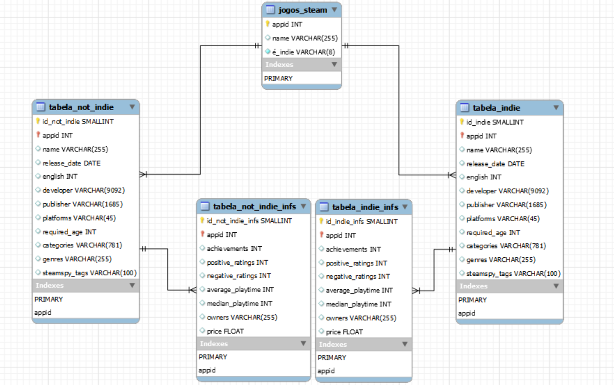

# Quarto projeto individual - Jogos indies e seu crescimento
O objetivo desse projeto foi pegar um conjunto de dados para analisarmos e criarmos um banco de dados, onde estejam organizados de forma padronizada e respondam nossas indagações. Também é necessário a apresentação através de dashboard sobre a exploração desses dados e a informação que foi obtida. Utilizamos o conjunto de dados do Steam, esta sendo uma plataforma de compra de jogos digitais. Conhecendo de longa data a plataforma por experiências próprias, nosso grupo em conjunto decidiu fazer uma apresentação mostrando a potência dos jogos indies nos últimos anos. O Dashboard e nossa apresentação responderá as seguintes perguntas:

- <h4> Quanto foi o crescimento dos lançamentos de jogos indies nos últimos 7 anos? </h4>
- <h4> Qual é a média de avaliações positivas entre os jogos indies e não indies? </h4>
- <h4> Qual é o tempo médio dos jogadores nesses jogos em comparação com os outros? </h4>
- <h4> Quantidade de jogos indies e não indies que são muitplayer. </h4>
- <h4> Qual é o valor dos jogos indies em comparação com os outros?</<h4>
- <h4> Quais são os 5 estilos que mais tem jogos indies e os dos não indie? </h4>
- <h4> Quais os 5 gêneros de maior quantidade de jogos entre os indies e não indies? </h4>

## Os arquivos e mostrando o modelo  
<h3> Há duas pastas e e dois arquivos na raiz: </h3>
<ol> 
<li> SQL/ - pasta onde há as tabelas, contendo 4 arquivos sql;</li>
<li> Consulta/ - pasta onde há os arquivos que mostram as consultas, um .txt com os códigos e um pdf com todos os prints das consultas;</li>
<li> Modelagem.png - este justamente é a modelagem do banco de dados;</li>
<li> Slide.pptx- o slide de apresentação com o dashbord. </li>
</ol>

## A modelagem 
Texto

 
